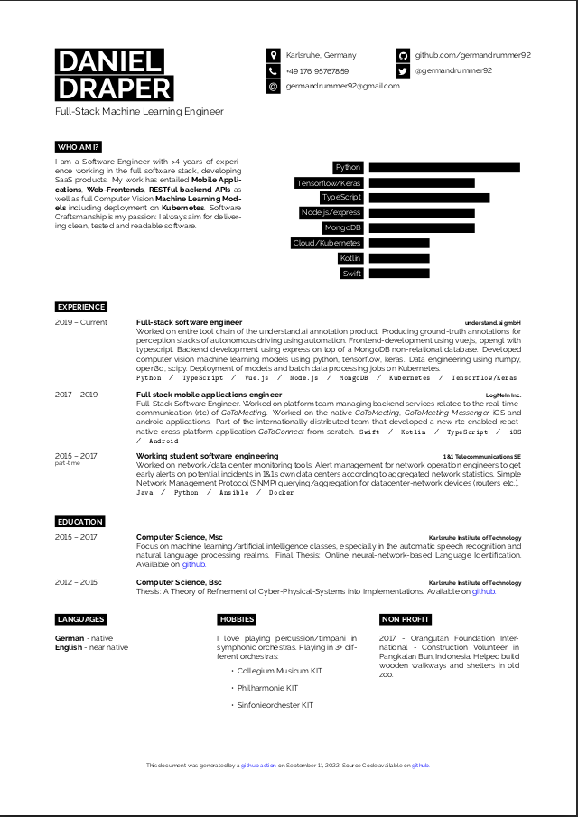

# Resume

Personal LaTeX resume based on [latextemplates.com template](https://www.latextemplates.com/template/developer-cv).

# Github action

Automatically builds a resume.pdf as a [github action](./.github/workflows/main.yml). 

Latest resume available as an artifact from the latest [action run](https://github.com/Germandrummer92/resume/actions/workflows/main.yml]).

# Preview

